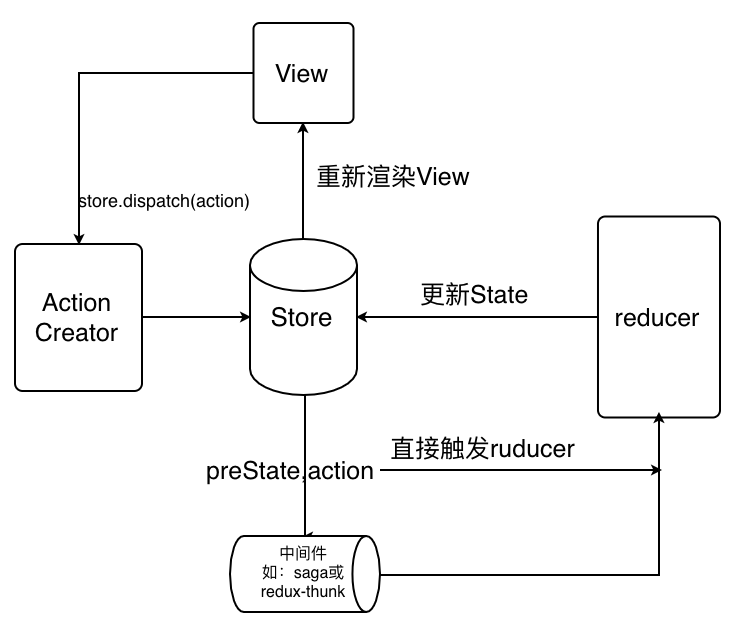

# ```Redux``` 基础教程

### 前言

在没有使用 ```Redux``` 的 ```React``` 项目中的组件通信和状态管理是特别繁琐的，比如子组件和父组件通信改变值，要通过父组件的方法。使用 ```Redux``` 可以解决组件之间的通信问题，因为 ```React``` 提出将展示组件与容器组件分离的思想，所以降低了 ```React``` 与 ```Redux```之间的耦合度。很多人都说，简单的应用可以不用此工具。但是我个人认为，中小型应用使用的话，可以使文件结构更加规范，代码可读性更强。

### 作用

  1. 分离UI与逻辑
  2. 跨组件通信

### 安装

  ```npm i redux -S```

### 核心概念

#### 1. ```state```

  单一数据源原则：整个应用的 ```state``` 数据都被储存在一棵 ```object tree``` 中，并且这个 ```object tree``` 只存在于唯一一个 ```store``` 中。

  ```state``` 其实就是一个普通的 ```JSON``` 对象。该对象包含 ```redux``` 的所有数据。
  
  当前的 ```state```，可以通过 ```store.getState()``` 获取。

  ```Redux``` 规定， 一个 ```State``` 对应一个 ```View```。只要 ```State``` 相同，```View``` 就相同。你知道 ```State```，就知道 ```View``` 是什么样，反之亦然。

  建议定义 ```state tree``` 层级结构不要太深。

  ```
  {
    text: 'text 文本',
    todos: [1,2,3,4]
  }
  ```

#### 2. ```action```

  ```State``` 只读原则：唯一改变 ```state``` 的方法就是触发 ```action```，```action``` 是一个用于描述已发生事件的普通对象。

  我们约定：```action``` 内必须使用一个字符串类型的 ```type``` 字段来表示将要执行的动作。通常其他参数用 ```payload``` 字段来存储以便管理方便，结构清晰。

  ```
  const ADD_TODO = 'ADD_TODO'

  // action
  {
    type: ADD_TODO,
    payload: {
      text: 'Build my first action'
    }
  }
  ```

#### 3. ```Action``` 创建函数

  ```Action``` 创建函数其实就是生成 ```action``` 的方法。“action” 和 “action 创建函数” 这两个概念很容易混在一起，使用时最好注意区分。

  有时候改变多少消息是，就会有多少个 ```action```。如果每次都写一遍类似的操作，就会显得繁琐、麻烦。我们可以通过定义一个函数来生成一个 ```Action```，这个函数就叫 ```Action``` 创建函数。

  ```
  const updateText = 'updateText'

  // action 创建函数
  function addTodo(text) {
    return {
      type: updateText,
      payload: {
        text,
      }
    }
  }

  const action = addTodo('Action Creator');
  ```

#### 4. ```Reducer```

  使用纯函数修改```state```原则：为了描述 ```action``` 如何改变 ```state tree``` ，你需要编写 ```reducers```。

  ```Reducer``` 是一个纯函数，只能通过使用```Reducer``` 用来修改 ```state tree``` 的数据。

  ```Reducer``` 是接收 ```state``` 和 ```action``` 参数，返回新的 ```state``` 的一个函数。

  ```Reducer``` 必须遵守的约束条件：
  
  1. 修改传入参数
  2. 执行有副作用的操作，如 API 请求和路由跳转
  3. 调用非纯函数，如 ```Date.now()``` 或 ```Math.random()```，因为每次会得到不一样的结果，无法预测 ```Reducer``` 执行后的结果。

  ```
  (previousState, action) => newState
  ```

  ```
  const initialState = {
    text: 'text 文本',
    todos: [1,2,3,4]
  };
  function updateText(state = initialState, action) {
    switch (action.type) {
      case 'updateText':
        return Object.assign({}, state, {
          text: action.payload.text
        })
      default:
        return state
    }
  }
  ```

#### 5. ```Store```

  使用 ```action``` 来描述“发生了什么”，和使用 ```reducers``` 来根据 ```action``` 更新 ```state``` 的用法。```Store``` 就是把它们联系到一起的对象。```Store``` 有以下职责：

  1. 维持应用的 ```state```
  2. 提供 ```getState()``` 方法获取 ```state```
  3. 提供 ```dispatch(action)``` 方法更新 ```state```
  4. 通过 ```subscribe(listener)``` 注册监听器
  5. 通过 ```subscribe(listener)``` 返回的函数注销监听器


### 工作流程

  

  1. 用户调用 ```store.dispatch(action)``` 触发 ```Action```
  2. 接着 ```Store``` 调用传入的 ```reducer``` 函数（此过程传入当前的 ```state tress``` 和 ```action```）
  3. 然后 ```reducer``` 计算下一个 ```state``` 返回给 ```Store``` 并更新 ```state tree```
  4. 最后 ```Store``` 根据新的 ```state tree``` 重新渲染 ```View```。


### ```React``` 集成 ```Redux```

#### 1. 介绍

  前面我们介绍了 ```redux``` 的核心概念和工作流程，接着我们介绍 ```React``` 集成 ```Redux``` 功能。

  首先，安装 ```Redux``` 的 ```React``` 绑定库：

  ```npm i react-redux -S```

  为了让页面的所有容器组件都可以访问 ```Redux store```，所以可以手动监听它。
  
  一种方式是把它以 ```props``` 的形式传入到所有容器组件中。但这太麻烦了，因为必须要用 ```store``` 把展示组件包裹一层，仅仅是因为恰好在组件树中渲染了一个容器组件。

  还有就是使用 ```React Redux``` 组件 ```<Provider>``` 来让所有容器组件都可以访问 ```store```，而不必显示地传递它。(推荐使用)。

#### 2. 纯 ```Redux``` 例子

  这里需要再强调一下: ```Redux``` 和 ```React``` 之间没有关系。```Redux``` 支持 ```React、Angular、Ember、jQuery``` 甚至纯 ```JavaScript```。

  尽管如此，```Redux``` 还是和 ```React``` 和 ```Deku``` 这类库搭配起来用最好，因为这类库允许你以 ```state``` 函数的形式来描述界面，```Redux``` 通过 ```action``` 的形式来发起 ```state``` 变化。

  这里我们介绍一下单纯使用 ```Redux``` 来实现其用法：

1. ```store``` 管理

  ```
  reduxDemo/store.ts
  ```

  ```
  import { createStore, Store, Reducer } from 'redux';

  interface IState {
    num: number;
  }

  const initState = {
    num: 1,
  };

  const reducers: Reducer<IState> = (state = initState, action) => {
    switch (action.type) {
      case 'add':
        return {
          ...state,
          num: state.num + 1,
        };
      case 'minus':
        return {
          ...state,
          num: state.num - 1,
        };
      default:
        return state;
    }
  };

  const store: Store<IState> = createStore(reducers);

  export default store;

  ```

2. 组件

  ```
  reduxDemo/index.tsx
  ```

  ```
  import * as React from 'react';
  import { Unsubscribe } from 'redux';
  import store from './store';

  class Index extends React.PureComponent {
    subscribe?: Unsubscribe;

    componentDidMount(): void {
      this.subscribe = store.subscribe(() => {
        this.forceUpdate();
      });
    }

    componentWillUnmount(): void {
      if (this.subscribe) {
        this.subscribe();
      }
    }

    render(): JSX.Element {
      return (
        <div>
          <div>{store.getState().num}</div>
          <button type="button" onClick={() => store.dispatch({ type: 'add' })}>加一</button>
          <button type="button" onClick={() => store.dispatch({ type: 'minus' })}>减一</button>
        </div>
      );
    }
  }

  export default Index;

  ```

#### 3. 使用 ```react-redux``` 例子

  通过上面的例子我们看到单纯在 ```React``` 项目中使用  ```Redux```，我们还需要手动监听 ```Store``` 中 ```state``` 的变化和取消监听，然后在手动进行强制更新重新渲染组件。

  接着我们举例使用在 ```React``` 项目中使用 ```react-redux``` 绑定库例子：

1. 展示组件

  纯UI展示组件，没有任何交互逻辑，并不关心数据来源和如何改变。

  ```
  components/Todo.tsx
  ```
  ```
  import React from 'react';

  interface IProps {
    text: string;
    completed: boolean;
    onClick?: (e: React.MouseEvent) => void;}

  export default function Todo({
    onClick,
    completed,
    text,
  }: IProps): JSX.Element {
    return (
      <li
        onClick={onClick}
        style={{
          textDecoration: completed ? 'line-through' : 'none',
        }}
      >
        {text}
      </li>
    );
  }
  ```

  ```
  components/TodoList.tsx
  ```
  ```
  import React from 'react';
  import Todo from './Todo';

  interface IProps {
    todos: any[];
    onTodoClick: (id: number) => void;
  }

  export default function TodoList({
    todos,
    onTodoClick,
  }: IProps): JSX.Element {
    return (
      <ul>
        {todos.map((todo) => (
          <Todo key={todo.id} {...todo} onClick={() => onTodoClick(todo.id)} />
        ))}
      </ul>
    );
  }
  ```

  ```
  components/Link.tsx
  ```
  ```
  import React from 'react';

  interface IProps {
    active: boolean;
    children: any;
    onClick: () => void;
  }

  export default function Link({
    active,
    children,
    onClick,
  }: IProps): JSX.Element {
    if (active) {
      return <span>{children}</span>;
    }

    return (
      <a
        href="javascript(0);"
        onClick={(e) => {
          e.preventDefault();
          onClick();
        }}
      >
        {children}
      </a>
    );
  }
  ```

  ```
  components/Footer.tsx
  ```
  ```
  import React from 'react';
  import FilterLink from '../containers/FilterLink';

  const Footer = (): JSX.Element => (
    <p>
      Show:
      {' '}
      <FilterLink filter="SHOW_ALL">
        All
      </FilterLink>
      {', '}
      <FilterLink filter="SHOW_ACTIVE">
        Active
      </FilterLink>
      {', '}
      <FilterLink filter="SHOW_COMPLETED">
        Completed
      </FilterLink>
    </p>
  );

  export default Footer;
  ```

2. 容器组件

  把 **展示组件** 连接到 ```Redux```。

  ```
  containers/FilterLink.tsx
  ```
  ```
  import { connect } from 'react-redux';
  import { setVisibilityFilter, namespace } from '../actions';
  import Link from '../components/Link';

  const mapStateToProps = (state: any, ownProps: any): object => ({
    active: ownProps.filter === state[namespace].visibilityFilter,
  });

  const mapDispatchToProps = (dispatch: any, ownProps: any): object => ({
    onClick: () => {
      dispatch(setVisibilityFilter(ownProps.filter));
    },
  });

  const FilterLink = connect(
    mapStateToProps,
    mapDispatchToProps,
  )(Link);

  export default FilterLink;
  ```

  ```
  containers/VisibleTodoList.tsx
  ```
  ```
  import { connect } from 'react-redux';
  import { toggleTodo, namespace } from '../actions';
  import TodoList from '../components/TodoList';

  const getVisibleTodos = (todos: any[], filter: string): any[] => {
    switch (filter) {
      case 'SHOW_COMPLETED':
        return todos.filter((t) => t.completed);
      case 'SHOW_ACTIVE':
        return todos.filter((t) => !t.completed);
      case 'SHOW_ALL':
      default:
        return todos;
    }
  };

  const mapStateToProps = (state: any): { todos: any[] } => ({
    todos: getVisibleTodos(state[namespace].todos, state[namespace].visibilityFilter),
  });

  interface TDispatchProps {
    onTodoClick: (id: number) => void;
  }

  const mapDispatchToProps = (dispatch: any): TDispatchProps => ({
    onTodoClick: (id: number) => {
      dispatch(toggleTodo(id));
    },
  });

  const VisibleTodoList = connect<
    {
      todos: any[];
    },
    TDispatchProps,
    any
  >(
    mapStateToProps,
    mapDispatchToProps,
  )(TodoList);

  export default VisibleTodoList;
  ```

  ```
  containers/AddTodo.tsx
  ```
  ```
  import React from 'react';
  import { connect } from 'react-redux';
  import { addTodo } from '../actions';

  interface IProps {
    onAddClick: (text: string) => void;
  }

  export const AddTodo = ({ onAddClick }: IProps): JSX.Element => {
    let input: any = null;

    return (
      <div>
        <form
          onSubmit={(e) => {
            e.preventDefault();
            if (!input.value.trim()) {
              return;
            }
            onAddClick(input.value);
            input.value = '';
          }}
        >
          <input
            ref={(node) => {
              input = node;
            }}
          />
          <button type="submit">Add Todo</button>
        </form>
      </div>
    );
  };

  export default connect(undefined, (dispatch: any) => ({
    onAddClick: (text: string) => dispatch(addTodo(text)),
  }))(AddTodo);
  ```

3. ```action```

  书写需要的 ```action```。

  ```
  let nextTodoId = 2;

  export const namespace = 'pages/index';

  export const ADD_TODO = 'ADD_TODO';
  export const SET_VISIBILITY_FILTER = 'SET_VISIBILITY_FILTER';
  export const TOGGLE_TODO = 'TOGGLE_TODO';

  export const addTodo = (text: string): object => {
    nextTodoId += 1;
    return {
      type: ADD_TODO,
      payload: {
        id: nextTodoId,
        text,
      },
    };
  };

  export const setVisibilityFilter = (filter: string): object => ({
    type: SET_VISIBILITY_FILTER,
    payload: {
      filter,
    },
  });

  export const toggleTodo = (id: number): object => ({
    type: TOGGLE_TODO,
    payload: {
      id,
    },
  });

  ```

4. ```Reducer```

  书写 ```Reducer``` 更新 ```state tree``。

  ```
  import { ReducerBuildOptions } from '@src/redux/reducer/typings';
  import {
    ADD_TODO,
    TOGGLE_TODO,
    SET_VISIBILITY_FILTER,
    namespace,
  } from './actions';

  export interface ModalState {
    visibilityFilter: string;
    todos: {
      id: number;
      text?: string;
      completed?: boolean;
    }[];
  }

  export const initialState: ModalState = {
    visibilityFilter: 'SHOW_ALL',
    todos: [
      {
        id: 1,
        text: 'Consider using Redux',
        completed: true,
      },
      {
        id: 2,
        text: 'Keep all state in a single tree',
        completed: false,
      },
    ],
  };

  export interface ModalReducers {
    updateState: ReducerBuildOptions<ModalState, ModalState>;
    [TOGGLE_TODO]: ReducerBuildOptions<ModalState, { id: number }>;
    [ADD_TODO]: ReducerBuildOptions<ModalState, { id: number; text: string }>;
    [SET_VISIBILITY_FILTER]: ReducerBuildOptions<ModalState>;
  }

  const reducers: ModalReducers = {
    updateState: (state, { payload }) => ({ ...state, ...payload }),
    [TOGGLE_TODO]: (state, { payload }) => {
      const { todos } = state;

      return {
        ...state,
        todos: todos.map((todo) => (todo.id === payload?.id
          ? {
            ...todo,
            completed: !todo.completed,
          }
          : todo)),
      };
    },
    [ADD_TODO]: (state, { payload }) => ({
      ...state,
      todos: state.todos.concat({
        id: payload?.id || Math.random(),
        text: payload?.text,
        completed: false,
      }),
    }),
    [SET_VISIBILITY_FILTER]: (state, { payload }) => ({
      ...state,
      ...payload,
    }),
  };

  const createReducer = (initialState, handlers) =>(state = initialState, action){
    const { type } = action;

    if (type in handlers) {
      return handlers[type](state, action);
    }
    return state;
  }

  export default combineReducers({
    [namespace]: createReducer(initialState,reducers)
  });
  ```

5. ```React``` 集成 ```Redux```

  ```
  import React from 'react'
  import { render } from 'react-dom'
  import { Provider } from 'react-redux'
  import { createStore } from 'redux'
  // 你的 reducer 集合
  import reducers from './reducers'
  import App from './components/App'

  let store = createStore(reducers)

  render(
    <Provider store={store}>
      <App />
    </Provider>,
    document.getElementById('root')
  )
  ```
